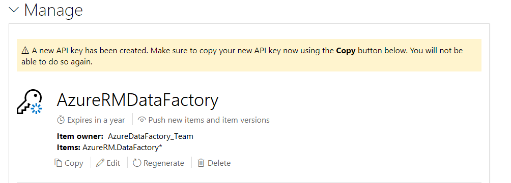
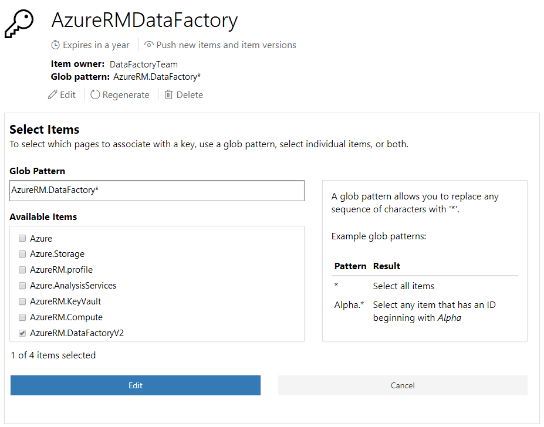

---
ms.date:  06/29/2018
contributor:  JKeithB
keywords:  gallery,powershell,cmdlet,psgallery
title:  Managing API keys
---
# Managing API Keys

The PowerShell Gallery supports creating multiple API keys that support a range of publising requirements. 
An API key can apply to one or more packages, grant specific privileges, and have an expiration date associated with it. 

> [!IMPORTANT]
> Users who published to the PowerShell Gallery prior to the introduction of scoped API keys will have a "Full access API key". This key does not have the security improvements built into scoped API keys, as it never expires, and applies to everything owned by the user. _If you delete this key, you cannot re-create it_, and you cannot create a new key that never expires. 

The image below shows the options available for creating scoped API keys.

In the screenshot above, we have created an API key named ‘AzureRMDataFactory’ that can be used to push packages for packages with names that begin with ‘AzureRM.DataFactory’, and is valid for 365 days. 
This is a typical scenario where different teams within the same organization work on different packages and the members of the team are provided the key which grants them privileges only on the package they are working on. 
The expiration serves as a mechanism to prevent stale or forgotten keys.

## Using Glob Patterns

If you are working on multiple packages and have a large list of packages to manage, you may choose to use globbing patterns to select multiple packages together. 
For example, if you wish to grant some key certain scopes on all packages whose ID starts with AzureRM.DataFactory, you could do so by specifying ‘AzureRM.DataFactory*’ in the Glob pattern text box, as shown above.

Using glob patterns to determine API key permissions will also apply to new packages matching the glob pattern. 
For example, you can push the package named ‘AzureRm.DataFactoryV2.Netcore’ with the key you would have created above, since the package matches the glob pattern “AzureRM.DataFactory*”.

## Obtain API Keys Securely

For security, a newly created key is never shown on the screen and is only available with the Copy button, as shown below.

> [!IMPORTANT]
> You can only copy the API key value immediately after creating or refreshing it. It will not be displayed, and will not be accessible again after the page is refreshed. If you lose the key value, you must use Regenerate, and copy the key after it is regenerated. 

## Controlling Permissions and Expiration

When creating an API key, you may define the scope to allow it to be used for any or all of the following:

* Push new packages
* Push new or update packages
* Unlist packages

In addition, any key you create will have an expiration. The default is a year, and may be set for 1, 90, 180, 270, or 365 days. 

Note that these settings cannot be changed once the key is created. 

## Editing and Deleting Existing API Keys

Once an API key is created, you may update the set of packages controlled by existing keys,  regenerate the key value, and delete the key. 
As noted above, you cannot modify the security scope for an existing API key, or how long the key may be used. 
The options available are shown in the screen shot below:

To change the packages controlled by a key, you can choose individual packages from the list, or change the glob pattern as needed. 

Use Regenerate to refresh the key value. 
Just like when you initially create a key, you must Copy the key value immediately after updating it, as the Copy option will not be available once the page is refreshed. 

You may Delete an existing key by choosing Delete, and then confirming the action in the pop-up that will be displayed. 
Once a key is deleted, it will be unusable. 

## Key Expiration

A warning e-mail will be sent to the account holder 10 days before the expiration of an API key so that you can act on it well in advance. 

If any key expires, a warning message will be displayed at the top of the API key management page, showing which key is no longer valid. 

