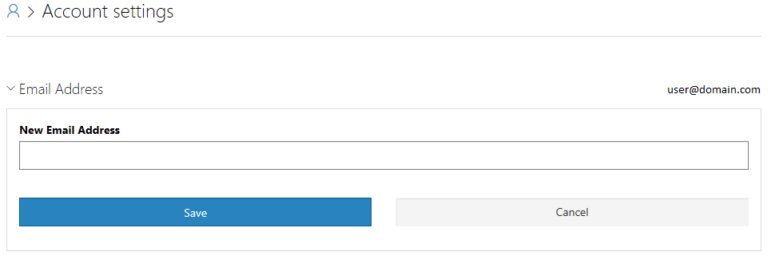
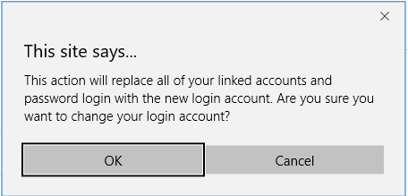
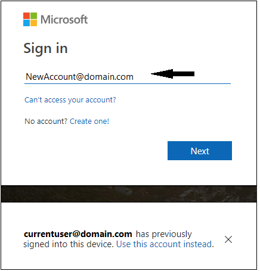
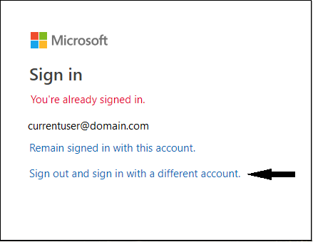

---
ms.date:  09/05/2018
contributor:  JKeithB
keywords:  gallery,powershell,cmdlet,psgallery
title:  PowerShell Gallery Account Settings
---
# PowerShell Gallery Account Settings

Your PowerShell Gallery account is a publicly visible name that is linked to either an email account and a login that is either a Microsoft ID (such as user@hotmail.com, or user@outlook.com), or an Azure Active Directory (AAD) account. 
Account Settings provides you:

* Control over the email account associated with your PowerShell Gallery account;
* Control over certain email notifications you can receive from the PowerShell Gallery;
* Ability to change the login account, which is the Microsoft ID or AAD account linked to your PowerShell Gallery account;
* How to set the graphic that is displayed beside your PowerShell Gallery account name

## Email Address

The email address is where the PowerShell Gallery will send email notifications.
This email address is never provided to other users directly by the PowerShell Gallery. 
You may use any email account you have access to, and it does not have to match the login account. 

After a new email address is entered, a verification mail will be sent to that address by the PowerShell Gallery. 
That verification mail contains a link back to the PowerShell Gallery that will complete the process of changing the registered email address. 
Until you complete the verification process, all emails will be sent to the address that was previously registered for the PowerShell Gallery account.

## Email Notifications

You may opt out of allowing the PowerShell Gallery to send email when:

* Another user wishes to contact you regarding a submission you have made;
* A packaged is published that you are the co-owner of;
* A package is pushed to the PowerShell Gallery using your account

As noted on the page, critical notifications from the PowerShell Gallery cannot be disabled, including:

* Notifications regarding the tests run by the PowerShell Gallery for submissions you have made;
* Security notifications;
* Account management notifications from the PowerShell Gallery administrators

## Change Login Account

Changing the login account requires you to be logged in with the current account to access Account Settings, but then logging in with the new account you wish to switch to. The sequence of steps are shown below.

1. When you click on "Change Account", a pop-up will be shown to explain that changing the login account applies to all uses of that account in the PowerShell Gallery. Review the information, then click "OK" to continue. 

2. You will then be prompted to log in, and must enter the **new account** you wish to use as your login account, as shown below.

3. You will see another prompt that you are signed in with the current account. Select "Sign out and sign in with a different account." 

4. You will then be prompted for the password of the new account, to complete the process. Once you enter the password, you will be returned to the Account Settings page, which will show that the login account has been updated.

## Enable Two-Factor Authentication (2FA)

Enabling two-factor authentication is a recommended security measure for all users who publish manually to the PowerShell Gallery. 
This change will require that your login account has at least two forms of authentication registered for it. One will be the password, the other may be 

* A phone number than can receive texts;
* Registration with an authenticator application on your phone, such as Microsoft Authenticator

Configuring what forms of authentication are used must be done via your AAD account information, or your Microsoft ID Account Security settings. 

Once you select "Enable", 2FA will be turned on for your account. 
If you leave the PowerShell Gallery, you will be required to authenticate your login account with the two forms of authentication you have configured. 

> [!IMPORTANT]
> Enabling two-factor authentication for the PowerShell Gallery will apply only to this site. However, if you are unable to log in, you may lose access to your PowerShell Gallery account. For that reason, it is highly recommended that you have at least three methods of authentication (password plus two others) associated with the login account.

## Change Profile Picture

The PowerShell Gallery relies on Gravatar to store and render the picture associated with your profile. To update your profile image, visit [Gravatar.com](http://www.gravatar.com/). 
