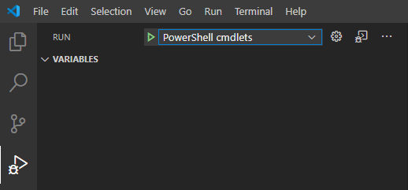

# Using Visual Studio Code for debugging compiled cmdlets

This guide will show you how to interactively debug C# source code for a compiled PowerShell module,
using Visual Studio Code and the C# extension.

> These steps will show you how to debug your module in PowerShell Core. They will not work for
Windows PowerShell.

This guide follows on from the [Writing Portable Modules][] guide.

## Creating a build task

It is a good idea to build your project automatically before launching a debugging session. This
ensures that you are debugging the latest version of your code.

This can be achieved with a build task:

1. In the Command Palette, run the `Configure Default Build Task` command

   

2. In the `Select a task to configure` dialog, choose `Create tasks.json file from template`

3. In the `Select a Task Template` dialog, choose `.NET Core`

This will create a new `tasks.json` file, if one does not exist yet.

To test your build task:

1. In the Command Palette, run the `Run Build Task` command

2. In the `Select the build task to run` dialog, choose `build`

## Setting up the debugger

To debug the PowerShell cmdlet, you will need to set up a custom launch configuration. This
configuration will:

- Build your source code

- Start PowerShell with your module loaded

- Leave PowerShell open in the terminal pane, so that you can invoke your cmdlet

- When you invoke your cmdlet, the debugger will stop at any breakpoints in your source code

The steps are:

1. Install the [C# for Visual Studio Code][] extension

2. In the Debug pane, add a debug configuration

3. In the `Select environment` dialog, choose `.NET Core`

4. This will open `launch.json`. With your cursor inside the `configurations` array, you will see the
`configuration` picker. If you do not see this, click on `Add Configuration`.

5. Choose `Launch .NET Core Console App`:

   

   This will create a default debug configuration.

6. Edit the `name`, `program`, `args` and `console` fields as follows:

   ```json
    {
        "name": "PowerShell cmdlets",
        "type": "coreclr",
        "request": "launch",
        "preLaunchTask": "build",
        "program": "pwsh",
        "args": [
            "-NoExit",
            "-NoProfile",
            "-Command",
            "Import-Module ${workspaceFolder}/myModule/bin/Debug/netstandard2.0/myModule.dll",
        ],
        "cwd": "${workspaceFolder}",
        "stopAtEntry": false,
        "console": "integratedTerminal"
    }
   ```

## Launching a debugging session

Now everything is ready to begin debugging.

- Place a breakpoint in the source code for the cmdlet you want to debug:

  

- Ensure that the `PowerShell cmdlets` configuration is selected in the configuration drop-down menu
in the Debug view:

  

- press `F5` or click on the `Start Debugging` button

- Switch to the terminal pane and invoke your cmdlet:

  

- Execution stops at the breakpoint:

  

You can step through the source code, inspect variables and inspect the call stack.

To end debugging, click `Stop` in the debug toolbar or press `Shift-F5`.

<!-- reference links -->
[Debugging in Visual Studio Code]: https://code.visualstudio.com/docs/editor/debugging
[Using Visual Studio Code for remote editing and debugging]: Using-VSCode-for-Remote-Editing-and-Debugging
[Writing Portable Modules]: /powershell/scripting/dev-cross-plat/writing-portable-modules
[C# for Visual Studio Code]: https://marketplace.visualstudio.com/items?itemName=ms-dotnettools.csharp
