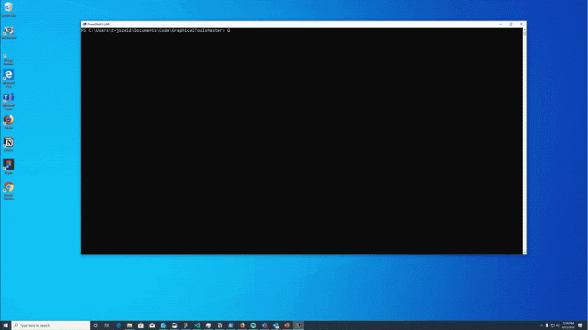
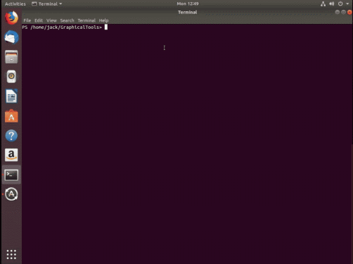
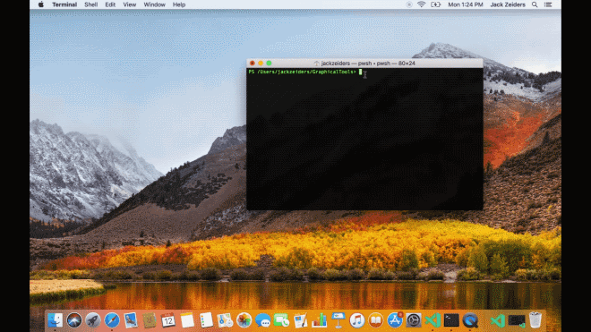

# What is PowerShell?

PowerShell is a cross-platform task automation and configuration management framework, consisting of
a command-line shell and scripting language. Unlike most shells, which accept and return text,
PowerShell is built on top of the .NET Common Language Runtime (CLR), and accepts and returns .NET
objects. This fundamental change brings entirely new tools and methods for automation.

:::row:::
   :::column span="":::
      Windows
      [](media/overview/windows-desktop.gif#lightbox)
      [Install on Windows](install/installing-powershell-core-on-windows.md)
   :::column-end:::
   :::column span="":::
      Linux
      [](media/overview/linux-desktop.gif#lightbox)
      [Install on Windows](install/installing-powershell-core-on-linux.md)
   :::column-end:::
   :::column span="":::
      macOS
      [](media/overview/macos-desktop.gif#lightbox)
      [Install on Windows](install/installing-powershell-core-on-macos.md)
   :::column-end:::
:::row-end:::

## Output is object-based

Unlike traditional command-line interfaces, PowerShell cmdlets are designed to deal with objects.
An object is structured information that is more than just the string of characters appearing on the
screen. Command output always carries extra information that you can use if you need it.

If you've used text-processing tools to process data in the past, you'll find that they behave
differently when used in PowerShell. In most cases, you don't need text-processing tools to extract
specific information. You directly access portions of the data using standard PowerShell object
syntax.

## The command family is extensible

Interfaces such as `cmd.exe` don't provide a way for you to directly extend the built-in command
set. You can create external command-line tools that run in `cmd.exe`. But these external tools
don't have services, such as Help integration. `cmd.exe` doesn't automatically know that these
external tools are valid commands.

The commands in PowerShell are known as _cmdlets_. You can use each cmdlet separately, but their
power is realized when you combine them to perform complex tasks. Like many shells, PowerShell gives
you access to the file system on the computer. PowerShell _providers_ enable you to access other
data stores, such as the registry and the certificate stores, as easily as you access the file
system.

You can create your own cmdlet and function modules using compiled code or scripts. Modules can add
cmdlets and providers to the shell. PowerShell also supports scripts that are analogous to UNIX
shell scripts and `cmd.exe` batch files.

## Support for command aliases

PowerShell supports aliases to refer to commands by alternate names. Aliasing allows users with
experience in other shells to use common command names that they already know for similar
operations in PowerShell.

Aliasing associates a new name with another command. For example, PowerShell has an internal
function named `Clear-Host` that clears the output window. You can type either the `cls` or
`clear` alias at a command prompt. PowerShell interprets these aliases and runs the
`Clear-Host` function.

This feature helps users to learn PowerShell. First, most `cmd.exe` and Unix users have a large
repertoire of commands that users already know by name. The PowerShell equivalents may not produce
identical results. However, the results are close enough that users can do work without knowing the
PowerShell command name. "Muscle memory" is another major source of frustration when learning a new
command shell. If you have used `cmd.exe` for years, you might reflexively type the `cls` command to
clear the screen. Without the alias for `Clear-Host`, you receive an error message and won't know
what to do to clear the output.

## PowerShell handles console input and display

When you type a command, PowerShell always processes the command-line input directly. PowerShell
also formats the output that you see on the screen. This difference is significant because it
reduces the work required of each cmdlet. It ensures that you can always do things the same way
with any cmdlet. Cmdlet developers don't need to write code to parse the command-line arguments or
format the output.

Traditional command-line tools have their own schemes for requesting and displaying Help. Some
command-line tools use `/?` to trigger the Help display; others use `-?`, `/H`, or even
`//`. Some will display Help in a GUI window, rather than in the console display. If you use the
wrong parameter, the tool might ignore what you typed and begin executing a task automatically.
Since PowerShell automatically parses and processes the command line, the `-?` parameter always
means "show me Help for this command".

> [!NOTE]
> If you run a graphic application in PowerShell, the window for the application opens.
> PowerShell intervenes only when processing the command-line input you supply or the application
> output returned to the console window. It does not affect how the application works internally.

## PowerShell has a pipeline

Pipelines are arguably the most valuable concept used in command-line interfaces. When used
properly, pipelines reduce the effort of using complex commands and make it easier to see the flow
of work. Each command in a pipeline passes its output, item by item, to the next command. Commands
don't have to handle more than one item at a time. The result is reduced resource consumption and
the ability to get output immediately.

The notation used for pipelines is similar to the notation used in other shells. At first glance, it
may not be apparent how pipelines are different in PowerShell. Although you see text on the screen,
PowerShell pipes objects, not text, between commands.

For example, if you use the `Out-Host` cmdlet to force a page-by-page display of output from
another command, the output looks just like the normal text displayed on the screen, broken up into
pages:

```powershell
Get-ChildItem | Out-Host -Paging
```

```Output
    Directory: /mnt/c/Git/PS-Docs/PowerShell-Docs/reference/7.0/Microsoft.PowerShell.Core

Mode                 LastWriteTime         Length Name
----                 -------------         ------ ----
d----          05/22/2020    08:30                About
-----          05/20/2020    14:36           9044 Add-History.md
-----          05/20/2020    14:36          12227 Clear-History.md
-----          05/20/2020    14:36           3566 Clear-Host.md
-----          05/20/2020    14:36          29087 Connect-PSSession.md
-----          05/20/2020    14:36           5705 Debug-Job.md
-----          05/20/2020    14:36           3515 Disable-ExperimentalFeature.md
-----          05/20/2020    14:36          25531 Disable-PSRemoting.md
-----          05/20/2020    14:36           7852 Disable-PSSessionConfiguration.md
-----          05/20/2020    14:36          25355 Disconnect-PSSession.md
-----          05/20/2020    14:36           3491 Enable-ExperimentalFeature.md
-----          05/20/2020    14:36          13310 Enable-PSRemoting.md
-----          05/20/2020    14:36           8401 Enable-PSSessionConfiguration.md
-----          05/20/2020    14:36           9531 Enter-PSHostProcess.md
...
<SPACE> next page; <CR> next line; Q quit
```

Paging also reduces CPU utilization because processing transfers to the `Out-Host` cmdlet when it
has a complete page ready to display. The cmdlets that precede it in the pipeline pause execution
until the next page of output is available.

### Objects in the pipeline

When you run a cmdlet in PowerShell, you see text output because it is necessary to represent
objects as text in a console window. The text output may not display all of the properties of the
object being output.

For example, consider the `Get-Location` cmdlet. The text output is a summary of information, not a
complete representation of the object returned by `Get-Location`. The heading in the output is added
by the process that formats the data for onscreen display.

```powershell
Get-Location
```

```Output
Path
----
C:\
```

Piping the output to the `Get-Member` cmdlet displays information about the object returned by
`Get-Location`.

```powershell
Get-Location | Get-Member
```

```Output
   TypeName: System.Management.Automation.PathInfo

Name         MemberType Definition
----         ---------- ----------
Equals       Method     bool Equals(System.Object obj)
GetHashCode  Method     int GetHashCode()
GetType      Method     type GetType()
ToString     Method     string ToString()
Drive        Property   System.Management.Automation.PSDriveInfo Drive {get;}
Path         Property   string Path {get;}
Provider     Property   System.Management.Automation.ProviderInfo Provider {get;}
ProviderPath Property   string ProviderPath {get;}
```

`Get-Location` returns a **PathInfo** object that contains the current path and other information.

## Built-in help system

Similar to Unix `man` pages, PowerShell includes detailed help articles that explain PowerShell
concepts and command syntax. Use the [Get-Help][] cmdlet to display these articles at the command
prompt or view the most recently updated versions of these articles in the PowerShell documentation
online.

## Next steps

To learn more about PowerShell, see the **Learning PowerShell** section of this site.

<!-- link references -->

[Get-Help]: /powershell/module/microsoft.powershell.core/Get-Help
