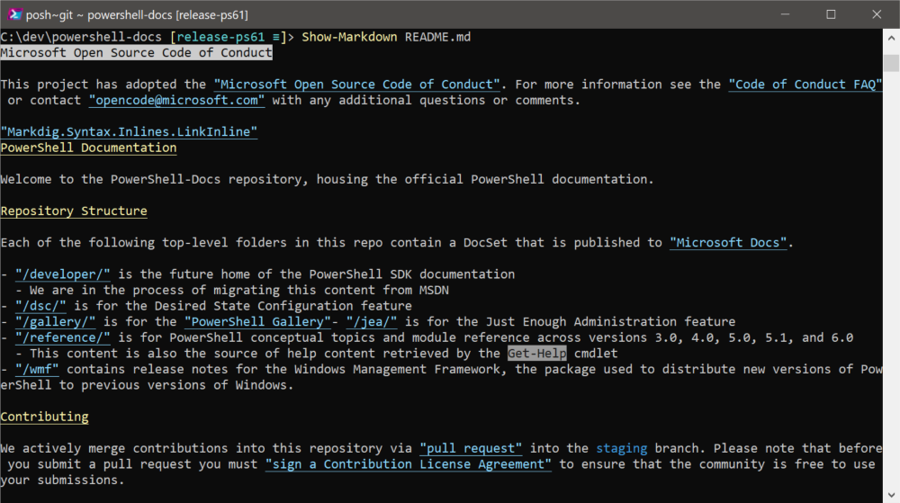
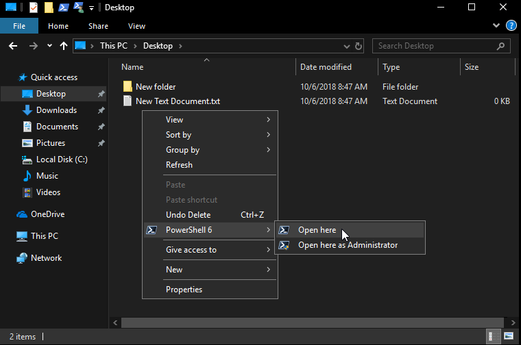
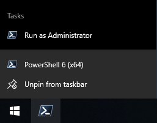

# What's New in PowerShell Core 6.1

Below is a selection of some of the major new features and changes that have been introduced
in PowerShell Core 6.1.

There's also **tons** of "boring stuff" that make PowerShell faster and more stable (plus lots and lots of bug fixes)!
For a full list of changes, check out our [changelog on GitHub](https://github.com/PowerShell/PowerShell/blob/master/CHANGELOG.md).

And while we call out some names below, thank you to
[all of the community contributors](https://github.com/PowerShell/PowerShell/graphs/contributors)
that made this release possible.

## .NET Core 2.1

PowerShell Core 6.1 moved to .NET Core 2.1 after it was
[released in May](https://blogs.msdn.microsoft.com/dotnet/2018/05/30/announcing-net-core-2-1/),
resulting in a number of improvements to PowerShell, including:

- performance improvements (see [below](#performance-improvements))
- Alpine Linux support (preview)
- [.NET global tool support](/dotnet/core/tools/global-tools) - coming soon to PowerShell
- [`Span<T>`](/dotnet/api/system.span-1?view=netcore-2.1)

## Windows Compatibility Pack for .NET Core

On Windows, the .NET team shipped the [Windows Compatibility Pack for .NET Core](https://blogs.msdn.microsoft.com/dotnet/2017/11/16/announcing-the-windows-compatibility-pack-for-net-core/),
a set of assemblies that add a number of removed APIs back to .NET Core on Windows.

We've added the Windows Compatibility Pack to PowerShell Core 6.1 release
so that any modules or scripts that use these APIs can rely on them being available.

The Windows Compatibility Pack enables PowerShell Core to use **more than 1900 cmdlets that ship with Windows 10 October 2018 Update and Windows Server 2019**.

## Support for Application Whitelisting

PowerShell Core 6.1 has parity with Windows PowerShell 5.1 supporting [AppLocker](https://docs.microsoft.com/en-us/windows/security/threat-protection/windows-defender-application-control/applocker/applocker-overview)
and [Device Guard](https://docs.microsoft.com/en-us/windows/security/threat-protection/device-guard/introduction-to-device-guard-virtualization-based-security-and-windows-defender-application-control) application whitelisting.
Application whitelisting allows granular control of what binaries are allowed to be executed used with PowerShell [Constrained Language mode](https://blogs.msdn.microsoft.com/powershell/2017/11/02/powershell-constrained-language-mode/).

## Performance improvements

PowerShell Core 6.0 made some significant performance improvements.
PowerShell Core 6.1 continues to improve the speed of certain operations.

For example, `Group-Object` has been sped up by 66%:

```powershell
Measure-Command { 1..100000 | % {Get-Random -Minimum 1 -Maximum 10000} | Group-Object }
```

|              | Windows PowerShell 5.1 | PowerShell Core 6.0 | PowerShell Core 6.1 |
|--------------|------------------------|---------------------|---------------------|
| Time (sec)   | 25.178                 | 19.653              | 6.641               |
| Speed-up (%) | N/A                    | 21.9%               | 66.2%               |

Similarly, sorting scenarios like this one have improved by more than 15%:

```powershell
Measure-Command { 1..100000 | % {Get-Random -Minimum 1 -Maximum 10000} | Sort-Object }
```

|              | Windows PowerShell 5.1 | PowerShell Core 6.0 | PowerShell Core 6.1 |
|--------------|------------------------|---------------------|---------------------|
| Time (sec)   | 12.170                 | 8.493               | 7.08                |
| Speed-up (%) | N/A                    | 30.2%               | 16.6%               |

`Import-Csv` has also been sped up significantly after a regression from Windows PowerShell.
The following example uses a test CSV with 26,616 rows and six columns:

```powershell
Measure-Command {$a = Import-Csv foo.csv}
```

|              | Windows PowerShell 5.1 | PowerShell Core 6.0 | PowerShell Core 6.1    |
|--------------|------------------------|---------------------|------------------------|
| Time (sec)   | 0.441                  | 1.069               | 0.268                  |
| Speed-up (%) | N/A                    | -142.4%             | 74.9% (39.2% from WPS) |

Lastly, conversion from JSON into `PSObject` has been sped up by more than 50%
since Windows PowerShell.
The following example uses a ~2MB test JSON file:

```powershell
Measure-Command {Get-Content .\foo.json | ConvertFrom-Json}
```

|              | Windows PowerShell 5.1 | PowerShell Core 6.0 | PowerShell Core 6.1    |
|--------------|------------------------|---------------------|------------------------|
| Time (sec)   | 0.259                  | 0.577               | 0.125                  |
| Speed-up (%) | N/A                    | -122.8%             | 78.3% (51.7% from WPS) |

## Check `system32` for compatible in-box modules on Windows

In the Windows 10 1809 update and Windows Server 2019,
we updated a number of in-box PowerShell modules to mark them as compatible with PowerShell Core.

When PowerShell Core 6.1 starts up, it will automatically include `$windir\System32`
as part of the `PSModulePath` environment variable.
However, it only exposes modules to `Get-Module` and `Import-Module`
if its `CompatiblePSEdition` is marked as compatible with `Core`.


```powershell
Get-Module -ListAvailable
```

> [!NOTE]
> You may see different available modules depending on what roles and features are installed.

```Output
...
    Directory: C:\WINDOWS\system32\WindowsPowerShell\v1.0\Modules

ModuleType Version    Name                                PSEdition ExportedCommands
---------- -------    ----                                --------- ----------------
Manifest   2.0.1.0    Appx                                Core,Desk {Add-AppxPackage, Get-AppxPackage, Get-AppxPacka...
Manifest   1.0.0.0    BitLocker                           Core,Desk {Unlock-BitLocker, Suspend-BitLocker, Resume-Bit...
Manifest   1.0.0.0    DnsClient                           Core,Desk {Resolve-DnsName, Clear-DnsClientCache, Get-DnsC...
Manifest   1.0.0.0    HgsDiagnostics                      Core,Desk {New-HgsTraceTarget, Get-HgsTrace, Get-HgsTraceF...
Binary     2.0.0.0    Hyper-V                             Core,Desk {Add-VMAssignableDevice, Add-VMDvdDrive, Add-VMF...
Binary     1.1        Hyper-V                             Core,Desk {Add-VMDvdDrive, Add-VMFibreChannelHba, Add-VMHa...
Manifest   2.0.0.0    NetAdapter                          Core,Desk {Disable-NetAdapter, Disable-NetAdapterBinding, ...
Manifest   1.0.0.0    NetEventPacketCapture               Core,Desk {New-NetEventSession, Remove-NetEventSession, Ge...
Manifest   2.0.0.0    NetLbfo                             Core,Desk {Add-NetLbfoTeamMember, Add-NetLbfoTeamNic, Get-...
Manifest   1.0.0.0    NetNat                              Core,Desk {Get-NetNat, Get-NetNatExternalAddress, Get-NetN...
Manifest   2.0.0.0    NetQos                              Core,Desk {Get-NetQosPolicy, Set-NetQosPolicy, Remove-NetQ...
Manifest   2.0.0.0    NetSecurity                         Core,Desk {Get-DAPolicyChange, New-NetIPsecAuthProposal, N...
Manifest   1.0.0.0    NetSwitchTeam                       Core,Desk {New-NetSwitchTeam, Remove-NetSwitchTeam, Get-Ne...
Manifest   1.0.0.0    NetWNV                              Core,Desk {Get-NetVirtualizationProviderAddress, Get-NetVi...
Manifest   2.0.0.0    TrustedPlatformModule               Core,Desk {Get-Tpm, Initialize-Tpm, Clear-Tpm, Unblock-Tpm...
...
```

You can override this behavior to show all modules using the `-SkipEditionCheck` switch parameter.
We've also added a `PSEdition` property to the table output.

```powershell
Get-Module Net* -ListAvailable -SkipEditionCheck
```

```Output
    Directory: C:\WINDOWS\system32\WindowsPowerShell\v1.0\Modules

ModuleType Version    Name                        PSEdition ExportedCommands
---------- -------    ----                        --------- ----------------
Manifest   2.0.0.0    NetAdapter                  Core,Desk {Disable-NetAdapter, Disable-NetAdapterBinding, ...
Manifest   1.0.0.0    NetConnection               Core,Desk {Get-NetConnectionProfile, Set-NetConnectionProf...
Manifest   1.0.0.0    NetDiagnostics              Desk      Get-NetView
Manifest   1.0.0.0    NetEventPacketCapture       Core,Desk {New-NetEventSession, Remove-NetEventSession, Ge...
Manifest   2.0.0.0    NetLbfo                     Core,Desk {Add-NetLbfoTeamMember, Add-NetLbfoTeamNic, Get-...
Manifest   1.0.0.0    NetNat                      Core,Desk {Get-NetNat, Get-NetNatExternalAddress, Get-NetN...
Manifest   2.0.0.0    NetQos                      Core,Desk {Get-NetQosPolicy, Set-NetQosPolicy, Remove-NetQ...
Manifest   2.0.0.0    NetSecurity                 Core,Desk {Get-DAPolicyChange, New-NetIPsecAuthProposal, N...
Manifest   1.0.0.0    NetSwitchTeam               Core,Desk {New-NetSwitchTeam, Remove-NetSwitchTeam, Get-Ne...
Manifest   1.0.0.0    NetTCPIP                    Core,Desk {Get-NetIPAddress, Get-NetIPInterface, Get-NetIP...
Manifest   1.0.0.0    NetWNV                      Core,Desk {Get-NetVirtualizationProviderAddress, Get-NetVi...
Manifest   1.0.0.0    NetworkConnectivityStatus   Core,Desk {Get-DAConnectionStatus, Get-NCSIPolicyConfigura...
Manifest   1.0.0.0    NetworkSwitchManager        Core,Desk {Disable-NetworkSwitchEthernetPort, Enable-Netwo...
Manifest   1.0.0.0    NetworkTransition           Core,Desk {Add-NetIPHttpsCertBinding, Disable-NetDnsTransi...
```

For more information about this behavior, check out [PowerShell RFC0025](https://github.com/PowerShell/PowerShell-RFC/blob/master/5-Final/RFC0025-PSCore6-and-Windows-Modules.md).

## Markdown cmdlets and rendering

Markdown is a standard for creating readable plaintext documents with
basic formatting that can be rendered into HTML.

We've added some cmdlets in 6.1 that allow you to convert and render
Markdown documents in the console, including:

- `ConvertFrom-Markdown`
- `Get-MarkdownOption`
- `Set-MarkdownOption`
- `Show-Markdown`

For example, `Show-Markdown` renders a Markdown file in the console:



For more information about how these cmdlets work, check out
[this RFC](https://github.com/PowerShell/PowerShell-RFC/blob/master/5-Final/RFC0025-Native-Markdown-Rendering.md).

## Experimental feature flags

Experimental feature flags enable users to turn on features that haven't been finalized.
These experimental features aren't supported and may have bugs.

You can learn more about this feature in [PowerShell RFC0029](https://github.com/PowerShell/PowerShell-RFC/blob/master/5-Final/RFC0029-Support-Experimental-Features.md).

## Web cmdlet improvements

Thanks to [@markekraus](https://github.com/markekraus), a whole slew of improvements have been made to our web cmdlets:
[`Invoke-WebRequest`](/powershell/module/microsoft.powershell.utility/invoke-webrequest)
and [`Invoke-RestMethod`](/powershell/module/microsoft.powershell.utility/invoke-restmethod).

- [PR #6109](https://github.com/PowerShell/PowerShell/pull/6109) - default encoding set to UTF-8 for `application-json` responses
- [PR #6018](https://github.com/PowerShell/PowerShell/pull/6018) - `-SkipHeaderValidation` parameter to allow `Content-Type` headers that aren't standards-compliant
- [PR #5972](https://github.com/PowerShell/PowerShell/pull/5972) - `Form` parameter to support simplified `multipart/form-data` support
- [PR #6338](https://github.com/PowerShell/PowerShell/pull/6338) - Compliant, case-insensitive handling of relation keys
- [PR #6447](https://github.com/PowerShell/PowerShell/pull/6447) - Add `-Resume` parameter for web cmdlets

## Remoting improvements

### PowerShell Direct tries to use PowerShell Core first

[PowerShell Direct](/virtualization/hyper-v-on-windows/user-guide/powershell-direct)
is a feature of PowerShell and Hyper-V that allows you to connect to a Hyper-V VM
without network connectivity or other remote management services.

In the past, PowerShell Direct connected using the inbox Windows PowerShell instance on the VM.
Now, PowerShell Direct first attempts to connect using any available `pwsh.exe` on the `PATH` environment variable.
If `pwsh.exe` isn't available, PowerShell Direct falls back to use `powershell.exe`.

### `Enable-PSRemoting` now creates separate remoting endpoints for preview versions

`Enable-PSRemoting` now creates two remoting session configurations:

- One for the major version of PowerShell. For example,`PowerShell.6`. This endpoint that can be relied upon across minor version updates as the "system-wide" PowerShell 6 session configuration
- One version-specific session configuration, for example: `PowerShell.6.1.0`

This behavior is useful if you want to have multiple PowerShell 6 versions installed and accessible
on the same machine.

Additionally, preview versions of PowerShell now get their own
remoting session configurations after running the `Enable-PSRemoting` cmdlet:

```powershell
C:\WINDOWS\system32> Enable-PSRemoting
```

Your output may be different if you haven't set up WinRM before.

```Output
WinRM is already set up to receive requests on this computer.
WinRM is already set up for remote management on this computer.
```

Then you can see separate PowerShell session configurations for
the preview and stable builds of PowerShell 6,
and for each specific version.

```powershell
Get-PSSessionConfiguration
```

```Output
Name          : PowerShell.6.2-preview.1
PSVersion     : 6.2
StartupScript :
RunAsUser     :
Permission    : NT AUTHORITY\INTERACTIVE AccessAllowed, BUILTIN\Administrators AccessAllowed, BUILTIN\Remote Management Users AccessAllowed

Name          : PowerShell.6-preview
PSVersion     : 6.2
StartupScript :
RunAsUser     :
Permission    : NT AUTHORITY\INTERACTIVE AccessAllowed, BUILTIN\Administrators AccessAllowed, BUILTIN\Remote Management Users AccessAllowed

Name          : powershell.6
PSVersion     : 6.1
StartupScript :
RunAsUser     :
Permission    : NT AUTHORITY\INTERACTIVE AccessAllowed, BUILTIN\Administrators AccessAllowed, BUILTIN\Remote Management Users AccessAllowed

Name          : powershell.6.1.0
PSVersion     : 6.1
StartupScript :
RunAsUser     :
Permission    : NT AUTHORITY\INTERACTIVE AccessAllowed, BUILTIN\Administrators AccessAllowed, BUILTIN\Remote Management Users AccessAllowed
```

### `user@host:port` syntax supported for SSH

SSH clients typically support a connection string in the format `user@host:port`.
With the addition of SSH as a protocol for PowerShell Remoting,
we've added support for this format of connection string:

`Enter-PSSession -HostName fooUser@ssh.contoso.com:2222`

## MSI option to add explorer shell context menu on Windows

Thanks to [@bergmeister](https://github.com/bergmeister), now you can enable a context menu on Windows. Now you can open your
system-wide installation of PowerShell 6.1 from any folder in the Windows Explorer:



## Goodies

### "Run as Administrator" in the Windows shortcut jump list

Thanks to [@bergmeister](https://github.com/bergmeister), the PowerShell Core shortcut's jump list now includes "Run as Administrator":



### `cd -` returns to previous directory

```powershell
C:\Windows\System32> cd C:\
C:\> cd -
C:\Windows\System32>
```

Or on Linux:

```ShellSession
PS /etc> cd /usr/bin
PS /usr/bin> cd -
PS /etc>
```

Also, `cd` and `cd --` change to `$HOME`.

### `Test-Connection`

Thanks to [@iSazonov](https://github.com/iSazonov), the [`Test-Connection`](/powershell/module/microsoft.powershell.management/test-connection)
cmdlet has been ported to PowerShell Core.

### `Update-Help` as non-admin

By popular demand, `Update-Help` no longer needs to be run as an administrator.
`Update-Help` now defaults to saving help to a user-scoped folder.

### New methods/properties on `PSCustomObject`

Thanks to [@iSazonov](https://github.com/iSazonov), we've added new methods and properties to `PSCustomObject`.
`PSCustomObject` now includes a `Count`/`Length` property that gives the number of items.

Both of these examples return `2` as the number of `PSCustomObjects` in the collection.

```powershell
@(
[pscustomobject]@{foo = '1'},
[pscustomobject]@{bar = '2' }).Length
```

```powershell
@(
[pscustomobject]@{foo = '1'},
[pscustomobject]@{bar = '2' }).Count
```

This work also includes `ForEach` and `Where` methods that allow you
to operate and filter on `PSCustomObject` items:

```powershell
@(
>> [pscustomobject]@{foo = 1},
>> [pscustomobject]@{foo = 2 }).ForEach({$_.foo+1})
```

```Output
2
3
```

```powershell
@(
>> [pscustomobject]@{foo = 1},
>> [pscustomobject]@{foo = 2 }).Where({$_.foo -gt 1})
```

```Output
foo
---
  2
```

### `Where-Object -Not`

Thanks to @SimonWahlin, we've added the `-Not` parameter to `Where-Object`.
Now you can filter an object at the pipeline for the non-existence of a property,
or a null/empty property value.

For example, this command returns all services that don't have any dependent services defined:

```powershell
Get-Service | Where-Object -Not DependentServices
```

### `New-ModuleManifest` creates a BOM-less UTF-8 document

Given our move to BOM-less UTF-8 in PowerShell 6.0,
we've updated the `New-ModuleManifest` cmdlet to create a BOM-less UTF-8 document
instead of a UTF-16 one.

### Conversions from PSMethod to Delegate

Thanks to [@powercode](https://github.com/powercode), we now support the conversion of a `PSMethod` into a delegate.
This allows you to do things like passing `PSMethod` `[M]::DoubleStrLen`
as a delegate value into `[M]::AggregateString`:

```powershell
class M {
    static [int] DoubleStrLen([string] $value) { return 2 * $value.Length }

    static [long] AggregateString([string[]] $values, [func[string, int]] $selector) {
        [long] $res = 0
        foreach($s in $values){
            $res += $selector.Invoke($s)
        }
        return $res
    }
}

[M]::AggregateString((gci).Name, [M]::DoubleStrLen)
```

For more info on this change, check out [PR #5287](https://github.com/PowerShell/PowerShell/pull/5287).

### Standard deviation in `Measure-Object`

Thanks to [@CloudyDino](https://github.com/CloudyDino), we've added a `StandardDeviation` property to `Measure-Object`:

```powershell
Get-Process | Measure-Object -Property CPU -AllStats
```

```Output
Count             : 308
Average           : 31.3720576298701
Sum               : 9662.59375
Maximum           : 4416.046875
Minimum           :
StandardDeviation : 264.389544720926
Property          : CPU
```

### `GetPfxCertificate -Password`

Thanks to [@maybe-hello-world](https://github.com/maybe-hello-world), `Get-PfxCertificate` now has the `Password` parameter,
which takes a `SecureString`. This allows you to use it non-interactively:

```powershell
$certFile = '\\server\share\pwd-protected.pfx'
$certPass = Read-Host -AsSecureString -Prompt 'Enter the password for certificate: '

$certThumbPrint = (Get-PfxCertificate -FilePath $certFile -Password $certPass ).ThumbPrint
```

### Removal of the `more` function

In the past, PowerShell shipped a function on Windows called `more` that wrapped `more.com`.
That function has now been removed.

Also the `help` function changed to use `more.com` on Windows, or the system's default pager
specified by `$env:PAGER` on non-Windows platforms.

### `cd DriveName:` now returns users to the current working directory in that drive

Previously, using `Set-Location` or `cd` to return to a PSDrive sent users
to the default location for that drive.

Thanks to [@mcbobke](https://github.com/mcbobke), users are now sent to the last known current working directory for that session.

### Windows PowerShell type accelerators

In Windows PowerShell, we included the following type accelerators to make it easier to work with their respective types:

- `[adsi]`: `System.DirectoryServices.DirectoryEntry`
- `[adsisearcher]`: `System.DirectoryServices.DirectorySearcher`
- `[wmi]`: `System.Management.ManagementObject`
- `[wmiclass]`: `System.Management.ManagementClass`
- `[wmisearcher]`: `System.Management.ManagementObjectSearcher`

These type accelerators were not included in PowerShell 6, but have been added to PowerShell 6.1 running on Windows.

These types are useful in easily constructing AD and WMI objects.

For example, you can query using LDAP:

```powershell
[adsi]'LDAP://CN=FooUse,OU=People,DC=contoso,DC=com'
```

Both of these examples create a Win32_OperatingSystem CIM object:

```powershell
[wmi]"win32_operatingsystem=@"
[wmiclass]"win32_operatingsystem"
```

```Output
SystemDirectory : C:\WINDOWS\system32
Organization    : Contoso IT
BuildNumber     : 18234
RegisteredUser  : Contoso Corp.
SerialNumber    : 12345-67890-ABCDE-F0123
Version         : 10.0.18234
```

### `-lp` alias for all `-LiteralPath` parameters

Thanks to [@kvprasoon](https://github.com/kvprasoon), we now have a parameter alias `-lp` for all the
built-in PowerShell cmdlets that have a `-LiteralPath` parameter.

## Breaking Changes

### MSI-based installation paths on Windows

On Windows, the MSI package now installs to the following path:

- `$env:ProgramFiles\PowerShell\6\` for the stable installation of 6.x
- `$env:ProgramFiles\PowerShell\6-preview\` for the preview installation of 6.x

This change ensures that PowerShell Core can be updated/serviced by Microsoft Update.

For more information, check out [PowerShell RFC0026](https://github.com/PowerShell/PowerShell-RFC/blob/master/5-Final/RFC0026-MSI-Installation-Path.md).

### Telemetry can only be disabled with an environment variable

PowerShell Core sends basic telemetry data to Microsoft when it is launched. The data includes the
OS name, OS version, and PowerShell version. This data allows us to better understand the
environments where PowerShell is used and enables us to prioritize new features and fixes.

To opt-out of this telemetry, set the environment variable `POWERSHELL_TELEMETRY_OPTOUT` to `true`,
`yes`, or `1`. We no longer support deletion of the file
`DELETE_ME_TO_DISABLE_CONSOLEHOST_TELEMETRY` to disable telemetry.

### Disallowed Basic Auth over HTTP in PowerShell Remoting on Unix platforms

To prevent the use of unencrypted traffic, PowerShell Remoting on Unix platforms now requires usage
of NTLM/Negotiate or HTTPS.

For more information on these changes, check out [PR #6799](https://github.com/PowerShell/PowerShell/pull/6799).

### Removed `VisualBasic` as a supported language in Add-Type

In the past, you could compile Visual Basic code using the `Add-Type` cmdlet.
Visual Basic was rarely used with `Add-Type`. We removed this feature to reduce the size of PowerShell.

### Cleaned up uses of `CommandTypes.Workflow` and `WorkflowInfoCleaned`

For more information on these changes, check out [PR #6708](https://github.com/PowerShell/PowerShell/pull/6708).
